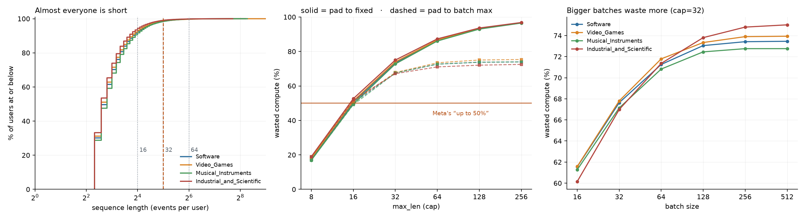

# GEM-Test

Testing three of the mechanism claims behind **Meta's Generative Ads Recommendation
Model (GEM)** on a single consumer GPU, using public Amazon Reviews data.

The point is not to reproduce GEM. It cannot be reproduced — it trains on thousands of
GPUs. The point is that GEM's published claims separate cleanly into two kinds, and only
one kind depends on scale:

| | Examples | Testable here? |
|---|---|---|
| **Mechanism claims** | interleaving beats pooling; a Student Adapter beats naive distillation; performance is log-linear in compute | **Yes** — these are claims about *proportions*, not absolute size |
| **Infrastructure claims** | 5D parallelism, MXFP8 kernels, SM-free collectives | **No, and deliberately not attempted** — the problems they solve (cross-zone bandwidth, thousand-GPU straggler skew) do not exist on one GPU |

So this repo tests the first kind and says so plainly. Negative results count, and so
does "not resolved" — the seed noise on this data is ~3% of NE, the same size as the
effects, so every number is reported with its spread and a single run is never read as
a result.

---

## The three claims

| | Claim | How it is tested | Status |
|---|---|---|---|
| **A** | InterFormer's interleaved structure beats pool-then-interact, which "risks losing critical engagement signals" | Fix parameter count, swap only the structure, sweep depth | **deferred** — see M1 |
| **B** | A **Student Adapter** — a light module that refines a teacher's outputs using fresh ground truth — beats naive knowledge distillation when the teacher is stale | Age the teacher deliberately: it trains on a sliding 730-day window ending at `T − k`, the student always on `[T − 365, T]`, both scored on `[T, T + 180]`. Sweep `k ∈ {0, 90, 365, 730, 1095}` days | M3 built, **M4 pending** |
| **C** | Performance scales log-linearly with compute | Five model sizes, NE vs FLOPs | M5 |

What M4 still needs, stated plainly: the `k` sweep across all four domains at three or
more seeds per cell. M3's three-seed pass on `Software` at `k = 0` is groundwork — it
established the windows, the controls, and the noise floor, and it found one effect
(arm C) large enough to survive that floor while overturning two others that had looked
real at two seeds.

**B is the centre of gravity**, and the reason claim A is deferred rather than next. A and
C have close analogues in the public literature; the Student Adapter does not, and it is
the only published mechanism that addresses teacher *staleness* rather than teacher
*accuracy*. Its whole premise is falsifiable at small scale: if the gap between adapter
and naive KD does not widen as the teacher ages, the mechanism does not do what it
claims.

M1 already measured why A is the weaker bet here — at a median of 7 events per user,
"preserving the full sequence" has very little to preserve, so the honest outcome is most
likely a null result about *this data* rather than about the structure. Effort went to
M3/M4 instead. What A needs to become conclusive is written down in M1 below, so the gap
is a stated choice rather than an omission.

---

## M0 — what the data actually looks like

Two findings, both of which changed the plan.

### 1. File size says nothing about whether a domain has sequences

Amazon Reviews is sparse in a way that is invisible until measured. The first domain
selection was made on file size — small categories, fast to iterate. It collapsed:

```
Digital_Music:  130,434 interactions / 100,952 users  =  1.29 per user
after k-core(5):  157 rows, 20 users
```

`data/probe.py` measures this properly before anything is built on it:

| domain | rows/user | users surviving k-core(5) | |
|---|---|---|---|
| All_Beauty | 1.11 | 357 | unusable |
| Handmade_Products | 1.13 | 89 | unusable |
| Digital_Music | 1.29 | 20 | unusable |
| **Software** | 1.88 | **149,625** | selected |
| **Video_Games** | 1.67 | **98,906** | selected |
| **Musical_Instruments** | 1.71 | **59,941** | selected |
| **Industrial_and_Scientific** | 1.51 | **54,567** | selected |

Small categories are sparse *in users*, not only in bytes — one-off purchases leave no
history to model. The four selected domains also differ in buyer type and repeat cadence
(digital goods / digital entertainment / physical hobby goods / B2B consumables), which
matters: if the domains are too similar, "cross-domain learning" and "one pooled domain"
become the same thing and the transfer experiment loses its control.

### 2. Padding waste is real here, but the lever is the cap — not jagged kernels



Meta reports that padding jagged sequences "would waste up to 50% of compute," on data
whose sequences run "from hundreds to tens of thousands of tokens per sample." Ours have
a **median of 6–7 events**. Measured across the four domains:

| cap | users covered | waste, pad-to-fixed | waste, pad-to-batch-max |
|---|---|---|---|
| 8 | 71.0% | 17.9% | 17.9% |
| **16** | 93.0% | **51.0%** | 50.5% |
| 32 | 98.6% | 73.8% | 67.5% |
| 64 | 99.8% | 86.6% | 72.4% |
| 128 | 100.0% | 93.3% | 73.7% |

Three things fall out:

- **Meta's 50% figure reproduces almost exactly — at `cap=16`.** It is not a property of
  jagged data in general; it is a property of a particular cap against a particular
  length distribution.
- **Batch-max padding barely helps, and then plateaus.** At `cap=8` it saves nothing; at
  `cap=32` it saves 6 points; beyond that it flattens near 74%, because the waste is
  dominated by within-batch spread rather than by the cap. Jagged kernels would be
  chasing those 6 points.
- **Choosing the cap is worth ~56 points**, from 73.8% at `cap=32` down to 17.9% at
  `cap=8` — at the cost of truncating 29% of users.

So on this dataset the honest conclusion is a negative one: **jagged-tensor machinery is
not where the compute goes.** Picking `max_len` deliberately is. The repo uses `cap=32`
(covering 98.6% of users) and spends its complexity budget elsewhere.

---

## M1 — the model runs

Both structures claim A compares are built, assembled behind one config, and
training converges on a single 8 GB GPU.

```
Software, 150k positions, 2 epochs, untuned

  pooled        NE 0.5187   AUC 0.9322   36 s/epoch   0.60M dense params
  interleaved   NE 0.5262   AUC 0.9224   56 s/epoch   0.67M dense params
```

This is a smoke test, not the experiment. What it establishes is narrower: the
pipeline learns (NE well below 1, AUC in a sane range for CTR), and both
variants overfit by epoch 2, so the real sweep needs early stopping and more
data.

**Normalized entropy** is the headline metric because raw log loss is not
comparable across these runs — the positive rate is fixed by the negative
sampling ratio, which differs between experiments. Dividing by the entropy of
the base rate removes that. AUC sits beside it on purpose: AUC is rank-only,
NE also responds to calibration, and M4 depends on exactly that split, since a
stale teacher degrades a student's calibration well before its ranking.

Two things must be fixed before the claim-A comparison means anything:

- **The variants differ by 12% in dense parameters.** Compared as they stand,
  the result would measure capacity rather than structure.
- **The interleaved variant is currently slightly worse and 60% slower**, which
  is the direction M0 predicted: at a median of 7 events per user, "preserving
  the full sequence" has little to preserve. Whether that is a fact about this
  dataset or about the structure is precisely what M2 has to separate — and if
  it cannot, that is a finding about what public data can support, reported as
  such.

```bash
python train.py --domain Software --variant pooled --epochs 2
python train.py --domain Software --variant interleaved --scale 0.5
```

---

## M3 — five ways to hand knowledge from a foundation model to a vertical one

GEM lists three post-training transfer techniques. Implemented as five arms, because
the interesting comparisons are *against nothing* and *against the naive version*:

| arm | technique | what crosses the gap | where it ends up |
|---|---|---|---|
| **A** | none | nothing | — |
| **B** | knowledge distillation | the teacher's output | the student's weights |
| **C** | + Student Adapter | a *corrected* output | the student's weights |
| **D** | parameter sharing | the teacher's weights | shared tensors |
| **E** | representation transfer | the teacher's features | an input at serving time |
| **E'** | *control* — the same features, batch-shuffled | nothing | — |

B and E differ more than they look. Distillation compresses the teacher into the
student's parameters, so the student's capacity is the ceiling. Representation transfer
hands the knowledge over as an *input*, so the student never has to memorise it — which
is why GEM can claim it adds no inference overhead, since in production those features
are precomputed and read from a table. This repo computes them live and tests the
**quality** claim only. The latency claim is not reproduced and is not claimed.

### The pooled foundation model, and why ids are offset

Before building it, the obvious question got measured:

```
users appearing in 2+ domains    15,135 / 346,190  =  4.37%
items appearing in 2+ domains    0                    (Amazon categories partition ASINs)
```

So cross-domain transfer cannot happen the obvious way — the same entity being seen in
two places. Ids are therefore **offset per domain**: pooling gives the foundation model
more data to fit its dense weights on, not a shared entity space it does not have. Two
channels remain, and they are what the arms actually test — the dense weights, and the
quantile buckets, where `price_bucket=7` means "expensive for its category" in every
domain because the cuts were made on within-domain quantiles. Those four vocabularies
are shared; store and category are offset like ids.

### Four things that would have silently produced numbers

**1. The teacher and the student have to live in the same id space.**

```
Video_Games item ids, loaded solo   :     3 .. 26,356
Video_Games item ids, inside pooled : 17,888 .. 44,241
```

A teacher trained on pooled data, scoring a batch built from `load_domain`, looks up
entirely unrelated products — confidently, and without raising anything. Every arm
therefore builds both models against pooled vocabularies, and the student simply never
sees ids outside its own domain. The cost is an inflated student embedding table; rows
that are never indexed receive no gradient, and `n_dense_parameters` — what the arms are
compared on — excludes embedding tables anyway.

**2. Pooling made the task easier, not harder.**

Negatives were being drawn uniformly from the whole pooled catalogue. But each user
belongs to one domain, and the domains partition the catalogue:

| domain | own items | share of catalogue | uniform negatives from a foreign domain |
|---|---|---|---|
| Software | 17,885 | 18.4% | **81.6%** |
| Video_Games | 26,354 | 27.2% | **72.8%** |
| Musical_Instruments | 25,528 | 26.3% | **73.7%** |
| Industrial_and_Scientific | 27,229 | 28.1% | **71.9%** |

So three quarters of the time the model only had to answer "is this item even in a
category this user shops in" — which the category embedding answers immediately. It
showed up as **AUC 0.988 pooled against 0.932 on the same solo data in M1**, with all
five arms inside a 1.5% band because every one of them was pinned at the ceiling.
Negatives are now drawn from the user's own domain, and AUC returns to 0.933.

Worth naming the shape of this one: it is not a bug in the sampler, which did exactly
what it was told. Pooling changed what "a random other item" means, and nothing in the
code had a reason to notice.

**3. `k` in days does not survive the move from Meta's data to Amazon's.**

The original M4 plan was the teacher on `[.., T−k]` and the student on `[T−k, T]`, with
`k ∈ {0, 3, 7, 14, 30}` days. Measuring it first:

| | |
|---|---|
| student positions at `k = 0` | **0** — `[T, T]` is a zero-width window |
| student positions at `k = 3` | **355** |
| teacher data removed at `k = 7` | **0.14%** |
| teacher data removed at `k = 30` | **0.54%** |

Two independent failures. The design tied the student's *data volume* to the teacher's
*lag*, which are independent in production; and a week of Amazon reviews is 0.14% of the
teacher's training set, so the whole sweep would have returned five near-identical
numbers — a false negative dressed as a result. Meta's week is enormous and its ad
creatives turn over fast; here the catalogue barely moves.

**4. Selecting the epoch and reporting the result on the same window.** This one was
mine, not the data's. The first trainer picked the best epoch by NE on the eval window
and then reported that same number — model selection on the test set. The bias is not
constant across arms: a noisier trajectory gets a luckier minimum, so the contaminated
metric rewards instability, which is one of the axes distillation is supposed to change.
There is now a separate 90-day `valid` window for choosing the epoch, and `eval` is
scored once with the chosen weights.

The corrected design fixes the student's window and sweeps the teacher's cutoff over a
range wide enough to matter:

```
 teacher  ├──── sliding 730d ────┤        k = 0, 90, 365, 730, 1095
 student                  ├──── 365d ────┤
 valid                                   ├─90d─┤          epoch selection
 eval                                          ├──── 180d ────┤   reported once
                                         T
```

| `k` | teacher window | teacher positions | vs `k=0` | student positions/domain |
|---|---|---|---|---|
| 0 | 2020-01-02 .. 2022-01-01 | 429,890 | — | 44k – 56k |
| 90 | 2019-10-04 .. 2021-10-03 | 460,611 | +7.1% | 44k – 56k |
| 365 | 2019-01-02 .. 2021-01-01 | 499,802 | +16.3% | 44k – 56k |
| 730 | 2018-01-02 .. 2020-01-02 | 523,716 | +21.8% | 44k – 56k |
| 1095 | 2017-01-02 .. 2019-01-02 | 522,439 | +21.5% | 44k – 56k |

The teacher window **slides** rather than expanding, which costs some realism and buys
the experiment's validity. An expanding teacher (everything up to `T−k`, what a
production FM actually trains on) loses 28% of its data at `k = 1095`, so staleness and
volume move together and a degradation cannot be attributed to either. With a sliding
window the volume is flat — and slightly *higher* for older windows, because these
categories were marginally busier in 2018 than 2021. So the confound runs **against** the
hypothesis: an older teacher gets more data, and if it still does worse, staleness is
what is left. Both modes are implemented; `teacher_days=None` selects expanding.

### Constraint inherited from arm D

Arm D copies embedding tables, which requires matching shapes, so **the student has the
teacher's `dim` and is made smaller along depth and inner widths** (`n_layers` 3→1,
`n_fmb`/`n_lcb` 16→8, `n_queries` 4→2). This is not a free choice: a `dim`-scaled student
would make arm D unimplementable, and the failure mode is that it silently degenerates
into arm A while still being labelled parameter sharing. `share_parameters` raises rather
than skipping, for the same reason.

### First numbers, now at three seeds

`Software`, `k = 0`, 4 epochs with selection on `valid`, reported once on `eval`.
Seeds 42, 1337, and 7 are all complete; the table below is `analysis/transfer_table.py`'s
output — mean, spread, and whether a gap against A clears the noise floor.

Teacher alone on `eval`: **NE 0.5574**.

| arm | n | NE mean | spread | AUC | vs A | resolved? | trainable dense |
|---|---|---|---|---|---|---|---|
| **A** no transfer | 3 | 0.5883 | 0.0808 | 0.9172 | — | — | 91,333 |
| **B** naive KD | 3 | 0.5658 | 0.0229 | 0.9270 | −3.83% | no | 91,333 |
| **C** KD + Student Adapter | 3 | **0.7763** | 0.0296 | 0.9278 | **+31.95%** | **yes** | 92,311 |
| **D** parameter sharing | 3 | 0.5277 | 0.0802 | 0.9338 | −10.31% | no | 91,333 |
| **E** representation transfer | 3 | 0.6357 | 0.0844 | 0.9299 | +8.05% | no | 165,253 |
| **E'** shuffled control | 3 | 0.5677 | 0.0253 | 0.9190 | −3.50% | no | 165,253 |

Three seeds changed the reading, not just the precision: **C's penalty is the only gap
in this table that clears the noise floor.** The two-seed pass had looked like D and B
also showed a consistent edge over A — at n=3 both collapse back inside the spread. The
milestone's own point, made concrete: two runs agreeing is not evidence, it is a
50/50 coin landing the same way twice.

**1. C is 32% worse than no transfer, and this is the one resolved result in the
table.** The hypothesis is that **the adapter turns distillation from a regulariser
into an overfitting amplifier.** It fits ground truth on the student's own training
window, and fits it better than the student does (`adapter_fit` 0.096 against `task`
0.15). The distillation target therefore becomes a high-fidelity copy of the training
labels, and the student is pushed to memorise that window harder than arm A ever is.
At `k = 0` this is all cost: the teacher is not stale, so there is nothing for the
adapter to correct, and it only relays the training labels a second time.

**This is not evidence against claim B.** The claim is that C's advantage *widens with
`k`*, so C being at its worst when the teacher is current is the baseline the sweep
needs. What it does expose is a design question the GEM post leaves open: it says the
adapter uses "the most recent ground-truth data", and if that is the student's own
training window then this amplification is structural. **Whether the adapter needs its
own held-out slice is the open blocker before M4** — untested here.

**2. E does not clearly beat its own shuffled control** (0.6357 against 0.5677, both
inside noise). There is still no resolved evidence that E transfers anything useful,
and its extra 74k parameters are not earning their place.

**3. D and B's apparent edges over A did not survive a third seed.** Both looked like
wins at n=2; at n=3 the gap sits inside A's own spread. Parameter sharing (D) is still
the cheapest arm to run and the most principled — it copies the four quantile-bucket
tables that are the only vocabularies actually shared across domains — but "cheapest
and principled" is not the same claim as "measured to work", and right now only the
first is true.

Worth noting separately, because M4 is built on it: **NE and AUC disagree here.** C
has a respectable AUC of 0.9278 and an NE of 0.7763; the *ranking* is intact and the
*calibration* is what collapsed — the exact split claim B's premise depends on, showing
up in real measurements rather than as an argument.

```bash
python -m data.transfer_data                       # reproduces the window table above
python train_transfer.py --domain Software --k 0 --student-seed 42
python -m analysis.transfer_table                  # mean, spread, and resolved?/no
python train_transfer.py --all-domains --k 0 90 365 730 1095    # the M4 sweep
```

Every gap above is inside the seed noise except C's, so `transfer_table` prints
`resolved? no` for the rest by design. Reading a small number of runs as a result is
the one mistake this milestone is set up to prevent — three seeds was still enough to
overturn two of the four "yes" reads a two-seed pass gave.

---

## Setup

```bash
python -m venv .venv
.venv/Scripts/activate            # Windows;  source .venv/bin/activate elsewhere
pip install -r requirements.txt

python -m data.download           # ~7.9 GB across four domains
python -m data.probe              # density check — run this before trusting a domain
python -m data.prepare            # k-core, temporal ordering, parquet
python -m data.features           # vocabularies and quantile buckets
python -m analysis.padding_waste  # reproduces the M0 figure
python -m data.transfer_data      # reproduces the M3 window table

pytest tests/ -q                  # 41 guardrails; skips cleanly without data
```

Models (M1 onward) additionally need a CUDA build of PyTorch:

```bash
pip install torch --index-url https://download.pytorch.org/whl/cu124
```

Raw and processed data are gitignored; every table and figure in this README regenerates
from the commands above.

---

## Layout

```
config.py                   domains, k-core thresholds, sequence cap — all measured, not guessed
data/
  download.py               fetch raw jsonl from HuggingFace (no loading script, by choice)
  probe.py                  density and k-core survival, per domain
  prepare.py                k-core filter, temporal sort, parquet output
  features.py               categorical encoding: vocabularies and quantile buckets
  dataset.py                causal sample construction, jagged batching
  pooled.py                 four domains in one id space, for the foundation model
  transfer_data.py          teacher / student / eval windows; the staleness dial
models/
  embeddings.py             shared-width field tables, sequence masking
  wukong.py                 stacked factorization machines (non-sequence tower)
  sequence.py               event model + candidate-keyed attention pooling, O(M*N)
  interformer.py            the two structures claim A compares
  gem.py                    assembly; one config drives every width
  transfer.py               the five FM-to-VM transfer arms
train.py                    training loop, normalized entropy, AUC
train_transfer.py           trains the pooled FM once, then five students from it
analysis/
  padding_waste.py          M0 result
tests/                      causality and architecture guardrails — no GPU needed
figures/                    committed — the README renders them
```

---

## Sources

- [Sequence learning: A paradigm shift for personalized ads recommendations](https://engineering.fb.com/2024/11/19/data-infrastructure/sequence-learning-personalized-ads-recommendations/) — Meta, Nov 2024
- [Meta's Generative Ads Model (GEM): The Central Brain](https://engineering.fb.com/2025/11/10/ml-applications/metas-generative-ads-model-gem-the-central-brain-accelerating-ads-recommendation-ai-innovation/) — Nov 2025
- [GEM Training: How Meta Doubled the Efficiency of Its LLM-Scale Ads Foundation Model](https://engineering.fb.com/2026/08/03/ml-applications/training-gem-at-llm-scale-meta-ads-recommendation-foundation-model/) — Aug 2026
- [From User Sequences to Scaling Laws](https://engineering.fb.com/2026/08/05/ml-applications/from-user-sequences-to-scaling-laws-a-multi-stage-architecture-for-metas-ads-ranking/) — Aug 2026
- Data: [Amazon Reviews 2023](https://amazon-reviews-2023.github.io/), McAuley Lab, UCSD

## License

MIT — see [LICENSE](LICENSE).
